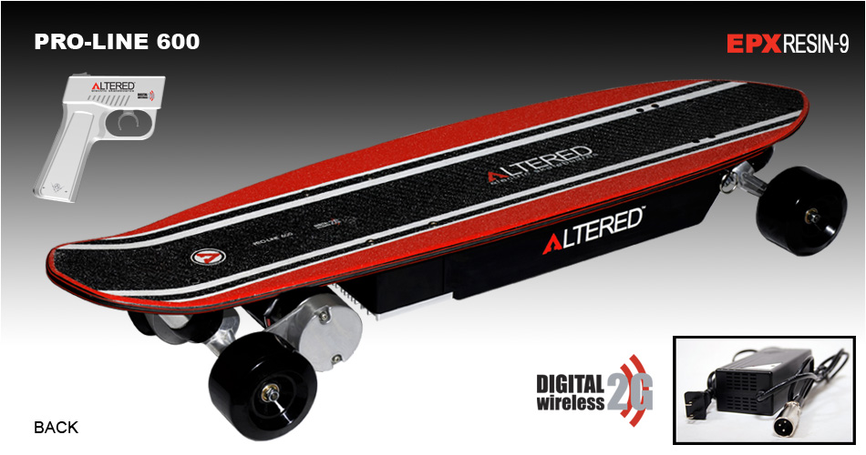

# Altered (by Exkate) Pro-Line 600 Electric Skateboard

## Drive manifest
* Model: SCM4-8240b by Senchuan Electric Machinery Co., LTD
* 600W power @ 36V
* 3800 +/- 5% rpm
* [pro-line-600-motor.jpg](pro-line-600-motor.jpg)

## Power manifest
* Model: SG1290T2 by S-PS (?)
  * Spec sheet: [SG1290T2-12v-9ah_sla-battery-with-t2-terminals.pdf](SG1290T2-12v-9ah_sla-battery-with-t2-terminals.pdf)
* 3x 9Ah *(cough, cough)* lead-acid cells @ 12V each
* Total 36V producing 600W @ (600/36)A = ~17A
* Total weight of (3*5.5 lbs each) = ~17 lbs
* [pro-line-600-replacement-batteries.jpg](pro-line-600-replacement-batteries.jpg)

# Lithium conversion

## Standard Li-ion chemistry
* 3.7V/cell
* (36V/3.7V) = ~10 cells in series (10s)
* Standard "inexpensive" 18650 cells...
  * realistically range from 2000-3000 mAh (2-3Ah)
  * usually have a C-rating of about 2.0
  * thus a 2.5Ah 18650 provides a series-current of about (2.0*2.5) = ~5A
  * to provide ~17A, we'd need 4x 18650s in parallel for each series-unit (10s4p !!)

## Premium "High drain" 18650 cells
* "High drain" cells often provide 20A+ of continuous discharge current
  * no need to wire any parallel units
  * a 2500mAh premium 18650 rated for 20A would have C-rating=8.0
* cells are more expensive and frequently sold as relabeled inferior cells
* 10x of these premium cells have (10*2.5Ah) = 25Ah total (nominal) energy
  * (vs 3*9Ah = 27Ah total (nominal) energy for 3x lead acid beasts)
  * Total weight of (10* ~45g) = ~1.0 lb
