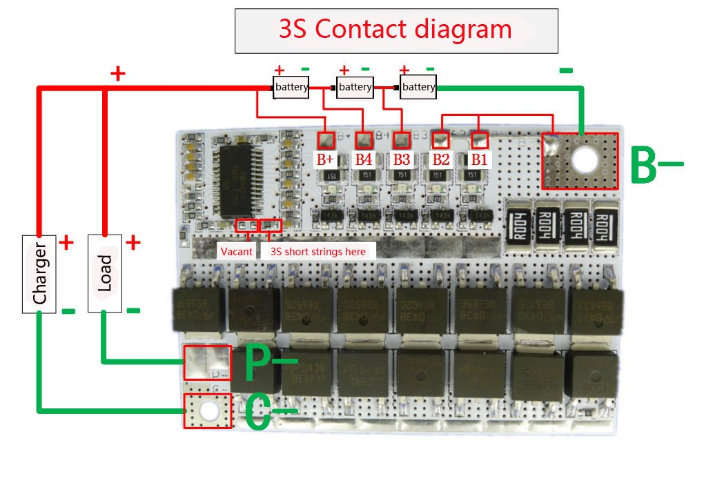
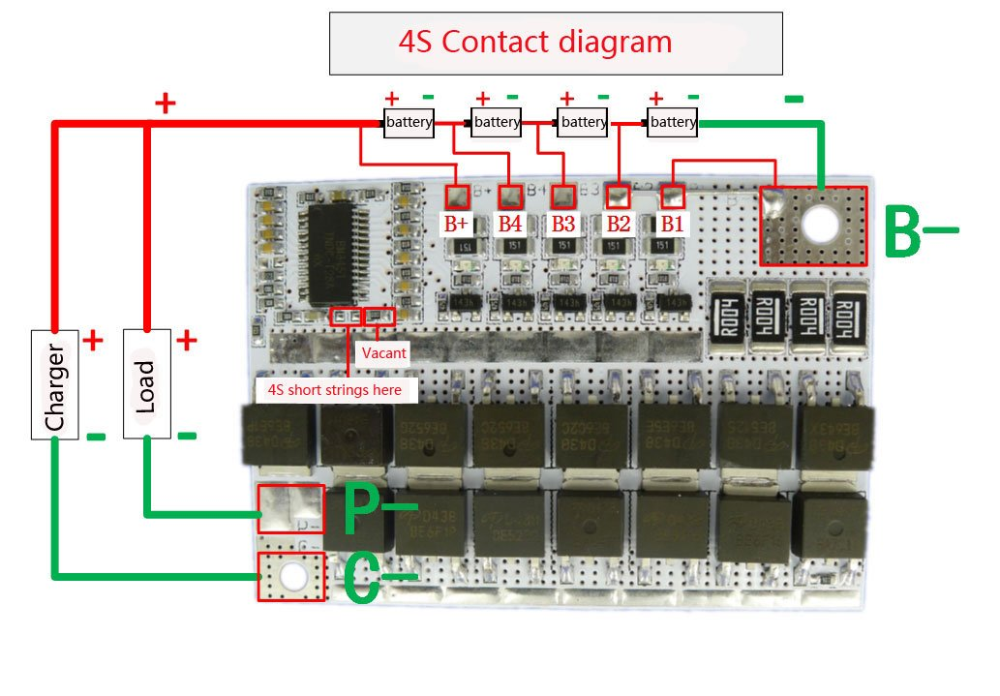
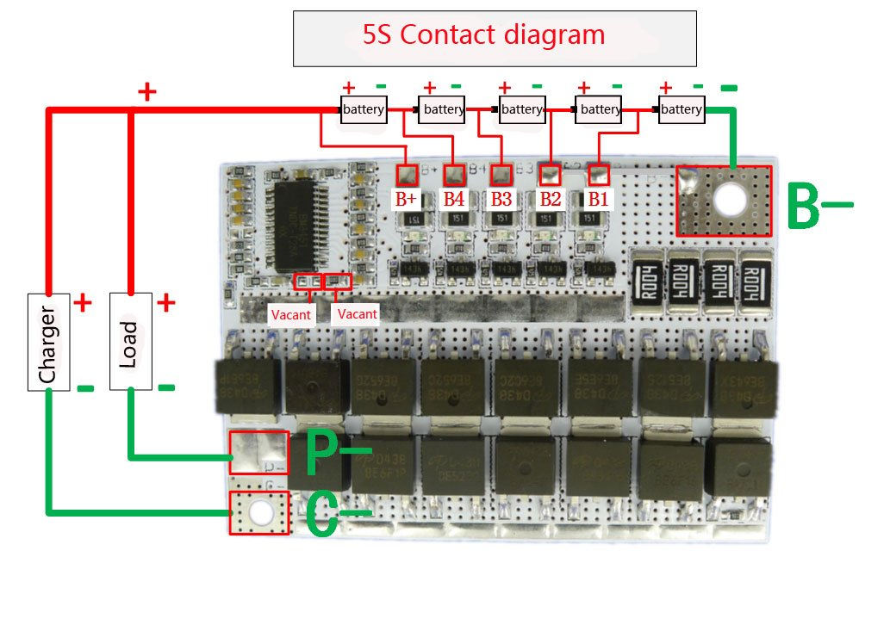

# BM3451 white-label BMS board 5s/4s/3s

* Original datasheeet: [bm3451-bms-datasheet.pdf](bm3451-bms-datasheet.pdf)
* AliExpress: https://www.aliexpress.com/item/32831689172.html
* Amazon: https://www.amazon.com/Aihasd-Ternary-Lithium-Battery-Protection/dp/B076DVHJ3V/ (which is where the 3/4/5s diagrams came from)


## 5s usage vs 4s or 3s 

It appears if you want to utilize the 3s or 4s BMS capability, you need to:
* short some pads next to the controller (like jumpers on a motherboard) **and**
* short some of the balance pads
  * short B- to B1, for 4S **or**
  * short B- to both B1 & B2, for 3S


## Balance Function

```
Cells’ balance function is used to balance the cells’ capacity in a pack. When all voltages of VC1,
(VC2-VC1), (VC3-VC2), (VC4-VC3) and (VC5-VC4) are lower or higher than VBAL , all the external balance
discharge circuits will not work. Otherwise the cell, whose voltage is higher than VBAL, will turn on the
external discharge circuit and make its voltage lower than VBAL. During charging, If the highest voltage of
five cells enters overcharge state and its cell balance circuit turns on, the charge control MOSFET turns off
and the external discharge circuit works and makes the battery voltage fall down to VREL1 which is the
overcharge release threshold, then turn on the charge control MOSFET for continuing charge .For a long
enough time of charge and discharge cycles, the voltages of all cells will reach to more than VBAL, and avoid
the capacity differences between batteries.
```


# Charge and discharge functions using same contacts


  


# Charge and discharge functions using different contacts

  
