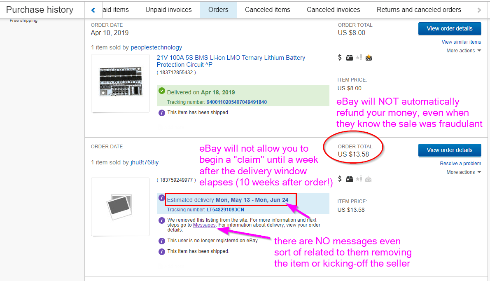
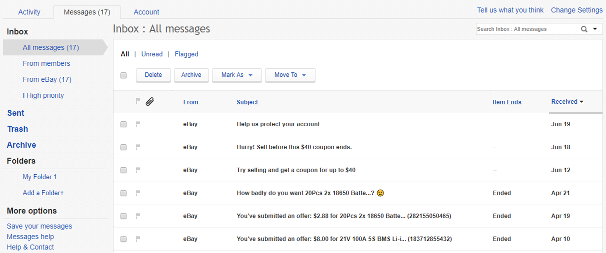
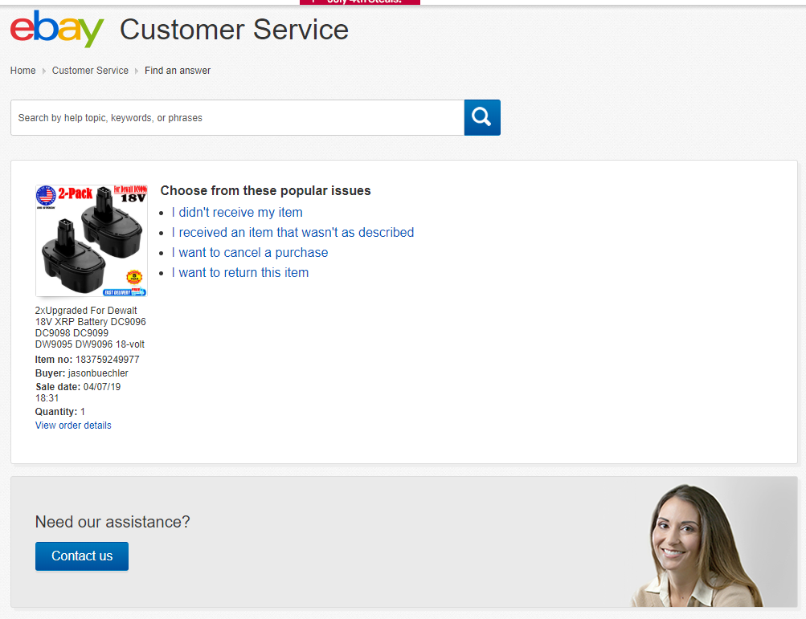
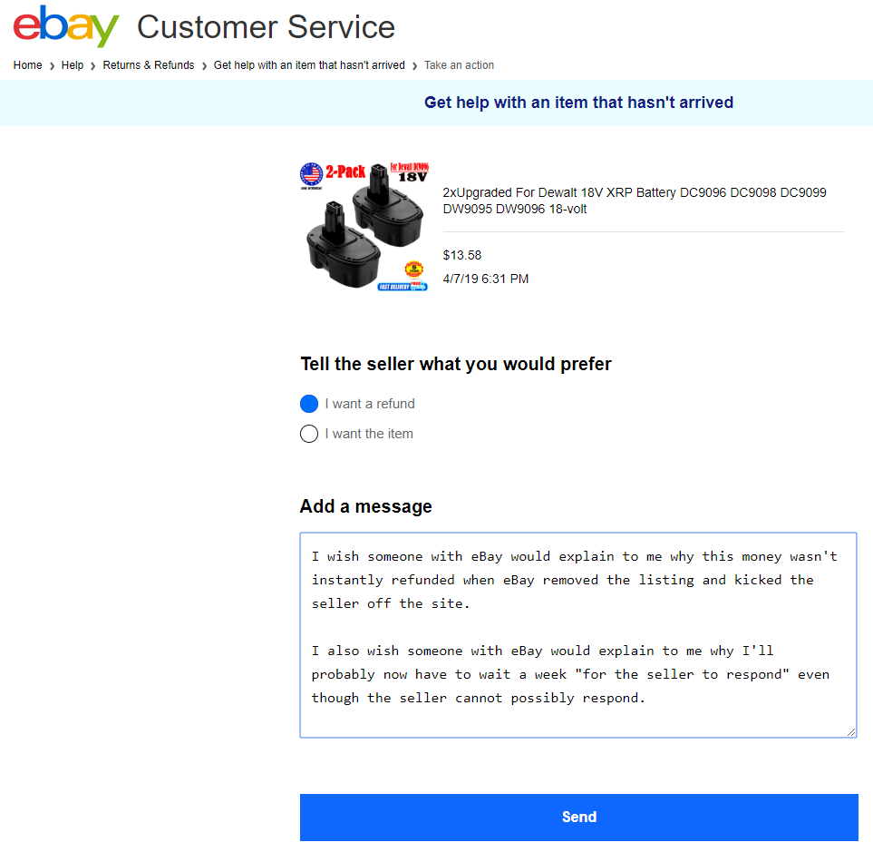
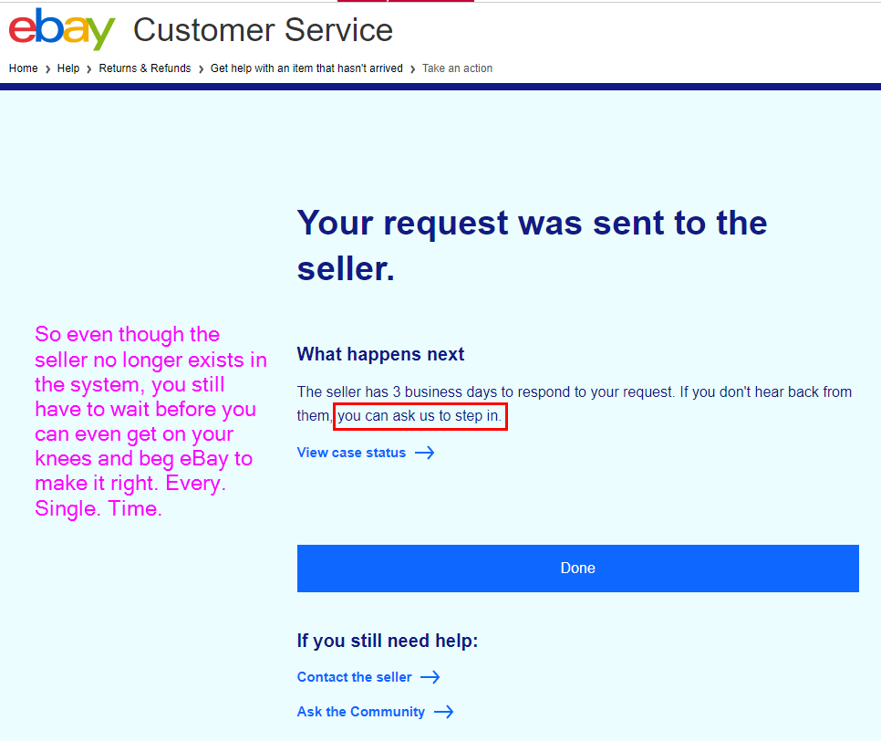

# How eBay helps international sellers commit fraud/scams

## Beware int'l sales where the delivery window is extremely long

**This is used to scammers' advantage by making it extremely likely you'll forget about your item**

Often, the seller will get found-out and their sales pulled and/or their account disabled... when this happens, eBay will NOT do anything to help you. 

In fact, they seem to go out of their way to make it difficult by not automatically doing anything, including even just simply sending you a message about the actions they've taken.

**They will even "break" the item's image and remove its title & description!!** ...so when you scroll through your purchases, you don't see the item for which they're accomplices in fraud.

## And IF you remember to hunt-down your refund...

Have fun waiting some more, and wasting your time dealing with customer service reps... when the whole process should have been automatic from the start.

