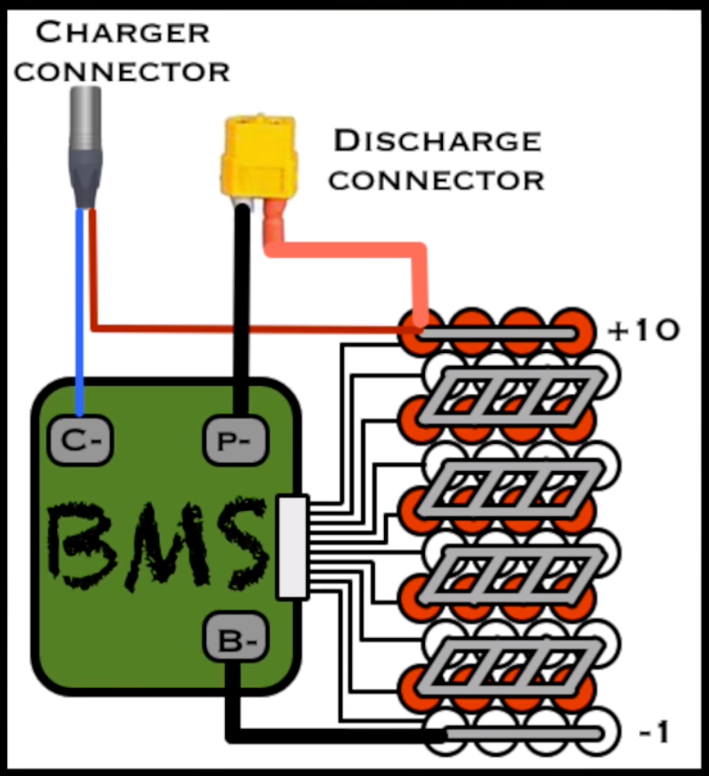

# Don't do this at home

## Don't do this unless you have an extremely firm grasp of both lithium-battery and DC-power engineering

### Don't do this at all.

## Why you don't want to do this:

Lithium cells have kind of a ... reputation.  They're kinda known for exploding.  Now, 18650 cells are generally quite a bit more safe than headline-capturing lithium batteries like lithium-polymer ones, but they still can be bad news if mistreated.

One isolated 18650 cell is actually pretty safe, but when you start connecting them in a high-ish voltage circuit, you start needing to hire some dedicated electronics to make sure they're treated well.  A "BMS" battery management/balancing board handles this task in most applications, communicating with each individual element of the wired series, as depicted here:

Modern power-tool companies out of a combination of...

* wanting to maximize profits by minimizing competing replacements/hardware
* knowing shadetree hardware will likely do an inferior job of battery-TLC

...have made communicating with the BMS board a pain in the ass. Instead of 2 poles for + and -, there's now a bunch of pins on power-tool lithium packs. Some pins for comms, some for charging, some for discharging, etc.  But note in the diagram above, the battery series still has +/- poles available: the discharge pins.

Well, in theory, anyway. Obviously the tool itself must be able to avail itself of the full voltage of the battery pack... and in this case, the tool is hardwired to the pack's +/- poles, but that doesn't necesarily need to be the case, and in fact is not actually the case in the above diagram. The tool could be engineered such that the BMS/controller only activates the full discharge circuitry after some kind of a comms handshake (like, for example, Apple might do.) You could consider this milwaukee pack to be a "dumb pack" because its controller limits its smarts to just keeping the batteries in shape, and not electing itself detective-in-charge-of-"is this the right tool?". Also there's a lot of amps that need to flow to high end tools and that increases the cost of the management board if it needs to be able to transistor-control that much current.

The reason you don't want to charge your lithium cell pack using the discharge pins (besides the obvious) is because you're circumventing the circuitry that protects the cells -- and you -- from potentially exploding.