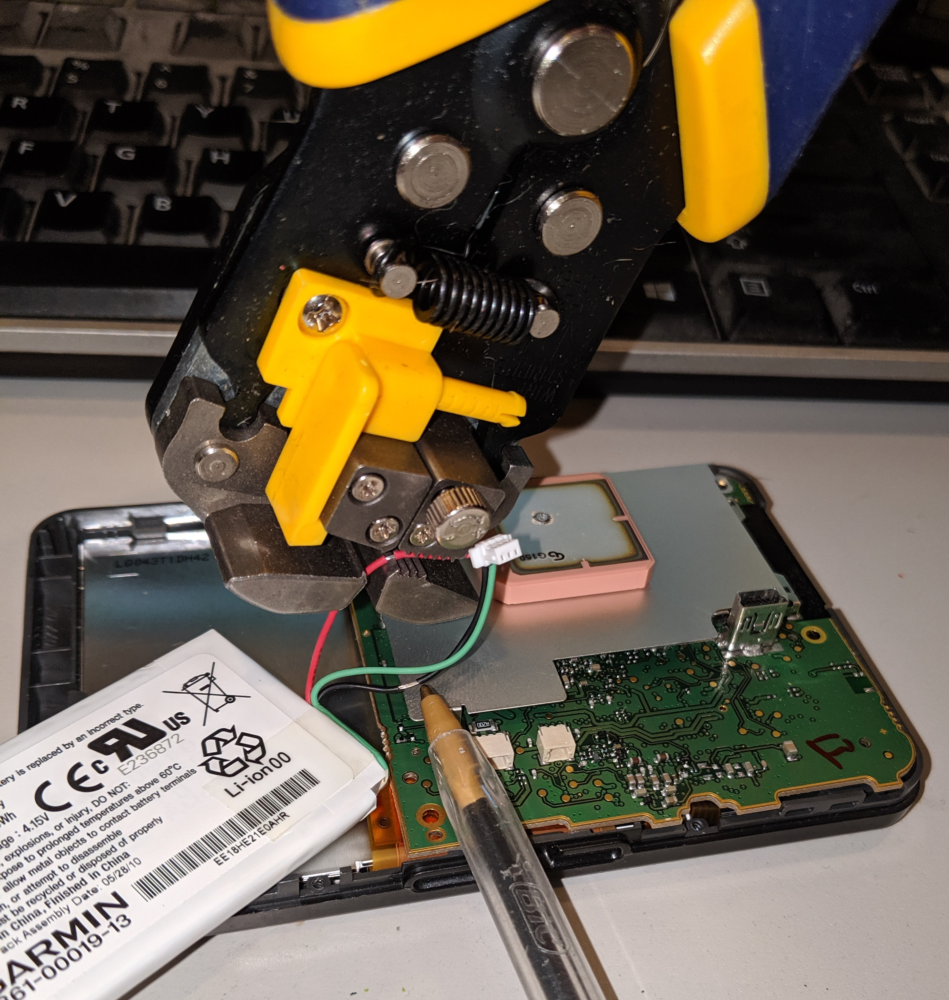
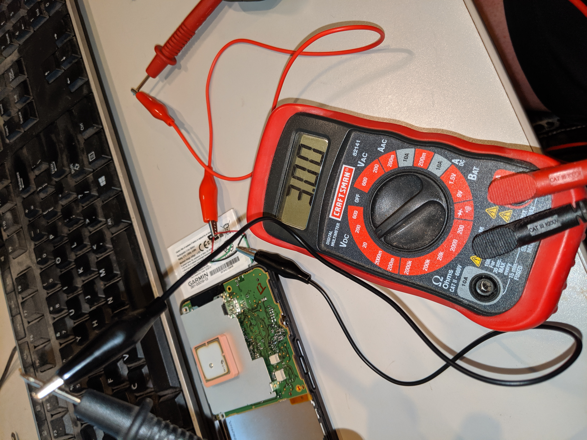
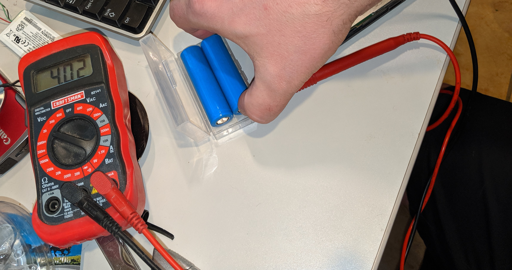
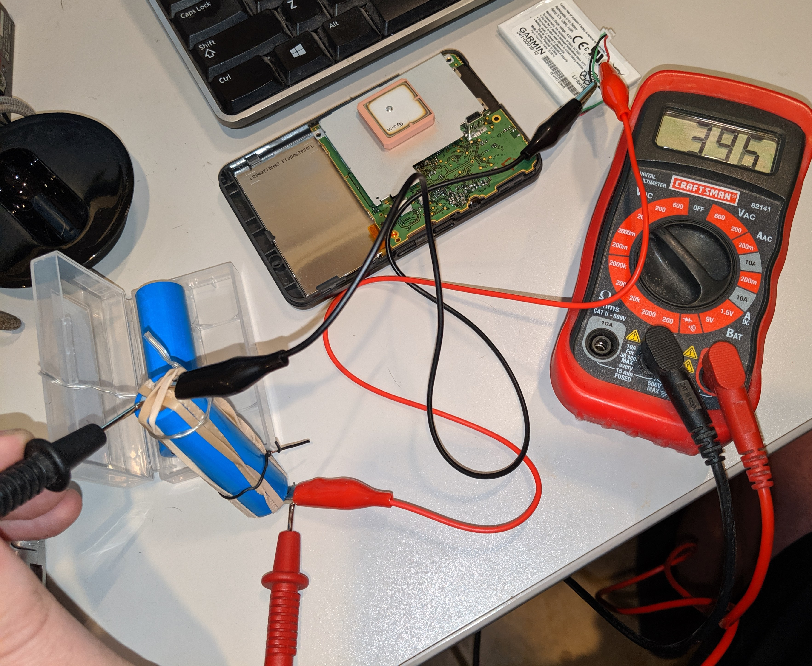
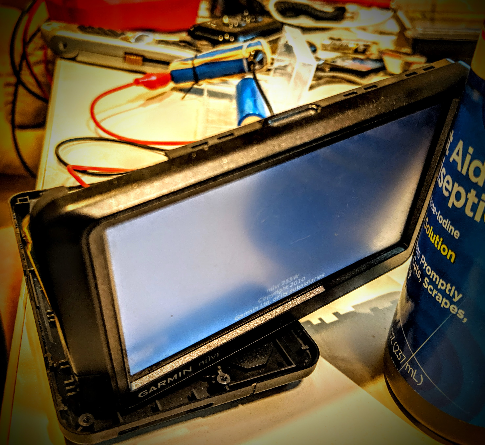

I needed to perform a "master reset procedure" on my oooold garmin I pulled out of a box, but its battery was too dead to power the unit... unfortunately, you cannot do the master reset while plugged into an external dc source, but I only needed battery power for a few minutes to get the reset done... so...

Get yoself some contact points with a wirestripper

you don't need much (pen is pointing at stripped area)
!(IMG_20190624_193026.jpg)

well 3.0v (out of 3.7v for Li-ion chemistry) isn't super dead but could be the cutoff garmin uses

now I happen to have a bunch of 18650 Li-ion cells lying around new charged, so above nominal voltage

introduce some alligator clip leads and rubber bands, and we have a parallel circuit with my 18650 cell

my photo is cruddy... but it worked
