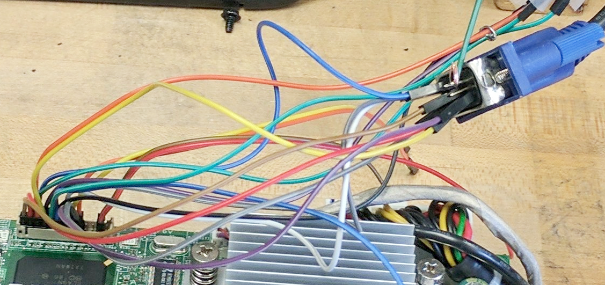
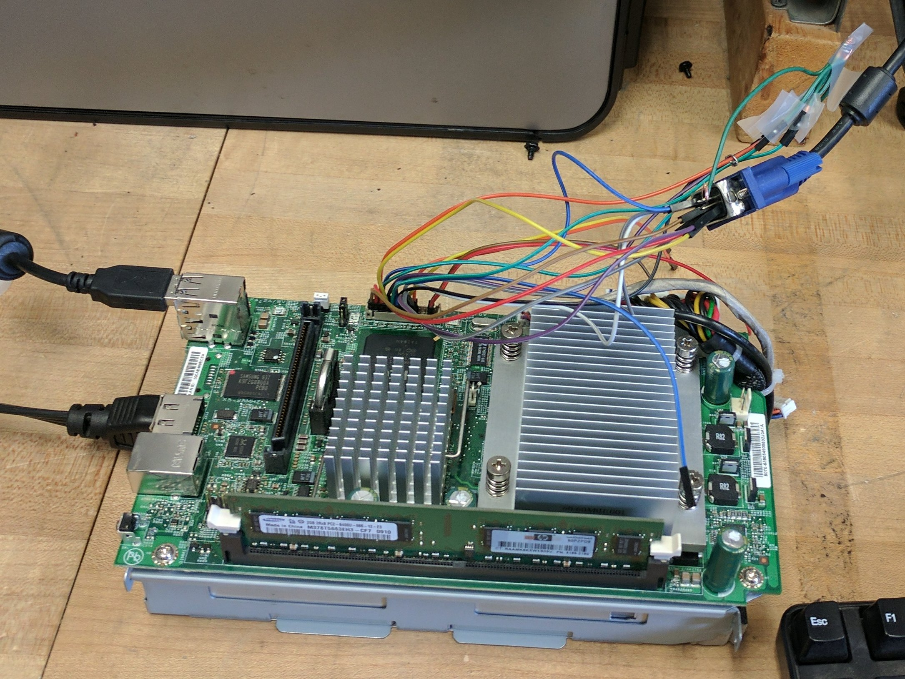
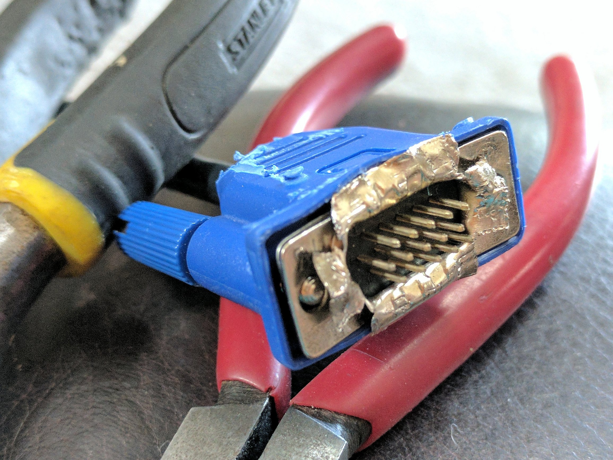
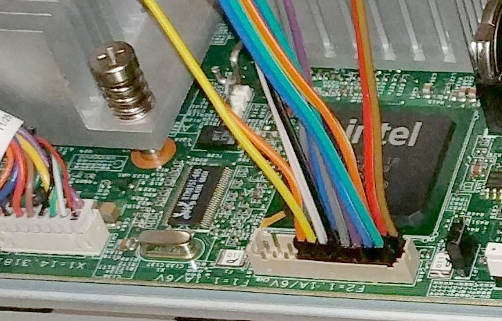
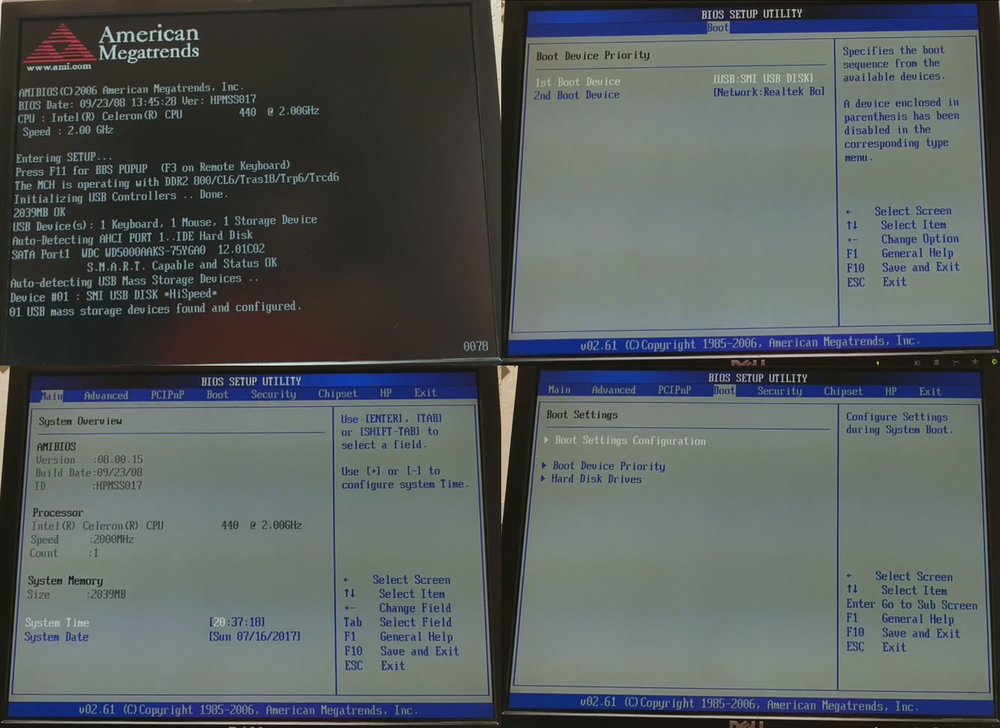
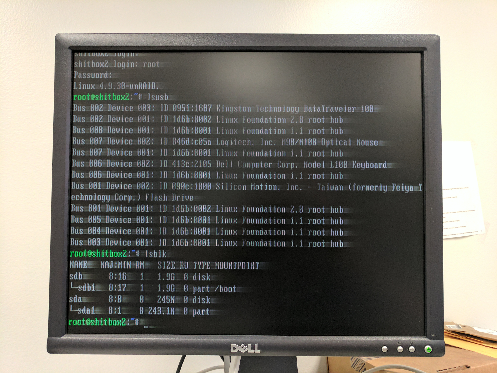

# $5.00 DIY MediaSmart Server VGA cable
## And using only basic tools

It's not pretty, nor guaranteed any longevity, but it allowed me to get into my bios and verify I could see/image and plan for modifying the onboard flash for GRUB. Plus, there's plenty of room for improvement, if desired, since it's ultra-simplistic. If you can build with legos, and get the motherboard out of the MediaSmart Server, you're already 99% qualified. As far as I know, this "cable" should work with any MSS's with the CN2/CN9 connector, not just the ex485 (i.e. ex470-series, ex480-series, ex490-series, Acer EasyStore H340-series...)

Here's the gist of what you'll need:
* A sacrificial VGA cable
* Some hot glue: to unify all your jumpers into "one connector" (just glob it above the 2P connectors, no need to actually glue anything to the board, this is actually pretty optional, so whatever works)
* Probably a pair (or two) of pliers: to bend the sleeve around vga cable pins for better access
* A sharp knife/x-acto/boxcutter, a dremel, or even just some sandpaper: the 2P connectors are ever-so-slightly too wide to set side-by-side in the header socket, and will need to have a sliver of plastic removed from a side or two
* The secret ingredient: At least 8x female/female jumper/breadboard cables of type "2P 2.0mm to 1P 2.54mm". The "2P-to-1P" part means 2pin-to-(two separate)-1pin connectors, and the mm sizes define the spacing between pins that the connector is meant for. They're often retailed specifically for Raspberry Pi hobbyists.

Regarding the jumpers to order: 
Note: GET 30cm OR LONGER!! I ordered 20cm-long ones since they were the cheapest I could find ($4.88 off ebay) from MDfly Electronics, and quickly found out that 20cm only just-barely gets the business end of the cable out of the door of my ex485. Not a problem functionally, but a little annoying. A length of 30 or 40 cm would be ideal.
* These are exactly what I ordered: http://www.ebay.com/itm/301833920734
* 40cm x 40pcs = https://www.amazon.com/gp/offer-listing/B0143YRNEY/
* 50cm x 40pcs = https://www.amazon.com/gp/offer-listing/B0143YRONY/
* (N. America-specific) search on ebay: https://www.ebay.com/sch/i.html?LH_PrefLoc=3&_nkw=%282p%2C2pin%2C2+pin%29+%28jumper%2Cpatch%2Ccable%2Cwires%2Cribbon%29+%282mm%2C2.0mm%2C2.0+mm%2C2+mm%29

MediaServer preparation:
If you're not interested in BIOS-access, you can skip this part! 
If you're totally new to this site (as I was, ten days ago), there's one or two tiny tweaks you might need to do to fully utilize the secret debug connector (which, by the way, is labeled CN2 on some boards, and CN9 on others). The word 'tweak' is kind of an overstatement: you're just connecting a couple pins together with something conductive. In electronics-industry jargon, this is known as "shorting" or "jumping"... and a "jumper" is the conductive thing connecting two pins. 
"A jumper" is usually understood to be a specific small piece of plastic with a metal bridge inside, of a standard size often used in electronics. You can see what they look like on Wikipedia, but don't worry if you don't have any: for our purposes, any length of wire that doesn't contact any other metal will do. And we can easily make one out of the logically-named jumper-cables we're using for everything else. You'll see what I mean, below. ANYWAY, the point is that, depending on your model and your intentions, you'll probably want to jumper one or both pairs of pins: 
* Apparently, starting with the ex485/ex487, bios access/interaction required a jumper on the "JP2" pins of the motherboard (these are also known as the J pins/jumper due to the printing on the board). See this post for the photos of the location and more info.
* Pins 3&4 of the debug connector also "might" need to be jumped. I wish I could say which models, or why, but what I know is: I couldn't access the bios of my ex485 until I jumper'd both JP2 AND pins 3&4. See the images below for more info.

That's all there is, folks! Trim a tiny bit of material off the sides of the 2P connectors, as necessary; use the diagram and its pin #'s to assemble the VGA-specific cable; and optionally fine/make yourself jumpers if you want BIOS access. I'm attaching the most instructive images to this post, but also I made this Imgur album (https://imgur.com/a/sH0O4) with more photos since I know when you're doing this, the more examples/visuals the better!!

Like legos: plug one side into the header, and plug the other side onto the appropriate VGA pins. It's that easy!

Obviously cable-management isn't my strong suit.  
In my defense, when I took this photo, I was doing some extra wiring that I misinterpreted as being necessary, while reading a blog-post from someone who was soldering-together their own cable.

Maybe not necessary... but fun! Probably did help, though: the VGA cable pins are spaced together a bit too tightly -- you're going to want to bend them slightly outward to make room for the 1P connectors.

For the header, use the pin-assignments from the diagram above. I didn't bother hot-gluing at this point, but if you glob it on all over, just above the 2P connectors, it should be nice and secure/firm.

The "jumper" I made to short header pins 3&4 isn't connected in this photo, FYI, but it is shown in a few of the others.

Proof of concept! The boot settings were what I was really after, so I could boot unRAID directly off its usb even with the bottom drive attached.

Note lsblk reports 2x usb disks, but only my linux usb is plugged in!  No form of lsblk, lsusb, diskmgmt.msc, etc had ever shown any hint of the "secret" 256MB onboard flash disk, until I shorted-together 3&4. This is the Windows recovery disk that TFTP's a fresh boot system image, used when recovering the NAS from a failed windows/windows disk, or factory reset.

